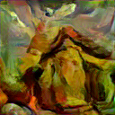
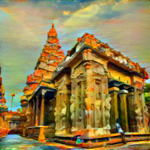

# Neural Style Transfer for Art 

A Deep Learning web application that merges the content of one image with the artistic style of another using the VGG19 (CNN) architecture. This project allows users to transform ordinary photos into masterpieces inspired by famous artists.

##  Project Overview
This application uses Neural Style Transfer (NST) to extract style features from famous paintings and apply them to content images. Built with a modular software architecture, it features a user-friendly interface for real-time art generation.

##  Tech Stack
- Language:Python 
- Framework: Streamlit (Web Interface)
- Deep Learning: PyTorch / VGG19 Architecture
- Data Handling: Pandas, NumPy
- Image Processing: Pillow (PIL)

##  Project Structure
- `app.py`: The main Streamlit frontend and application logic.
- `nst_utils.py`: Utility functions for VGG19 model loading, loss calculations, and preprocessing.
- `requirements.txt`: List of Python dependencies.
- `artists.csv`: Metadata mapping for the artistic style library.
- `dataset_samples/`: Sample images from a larger 5,000-image dataset used for testing.

##  Sample Results



##  How to Run
1. Clone the repository:
   ```bash
   git clone [https://github.com/shanmu-hub/Neural-Style-Transfer-Art.git](https://github.com/shanmu-hub/Neural-Style-Transfer-Art.git)
